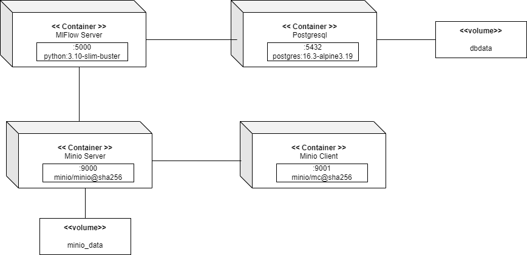

# Dokumentasi Jawaban

## 1. Image yang digunakan
- **Minio Server**: minio/minio@sha256.
- **Minio Client**: minio/mc@sha256.
- **Postgresql**: postgres:16.3-alpine3.19.
- **MlFlow**: Menggunakan base image python python:3.10-slim-buster dengan tambahan package libpq-dev dan gcc untuk keperluan engine postgresql (Lihat mlflow/DockerFile).

## 2. Volume yang digunakan
- **dbdata** untuk postgresql
- **Minio_data** untuk minio server

## 3. Port yang digunakan
- **Minio server**: 9000
- **Minio client**: 9001
- **Postgresql**: 5432
- **mlFlow**: 5000

## 4. Deployment Diagram

## 5. Cara build dan Run
#### `docker-compose up -d --build`
